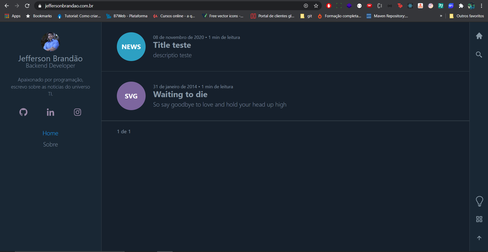
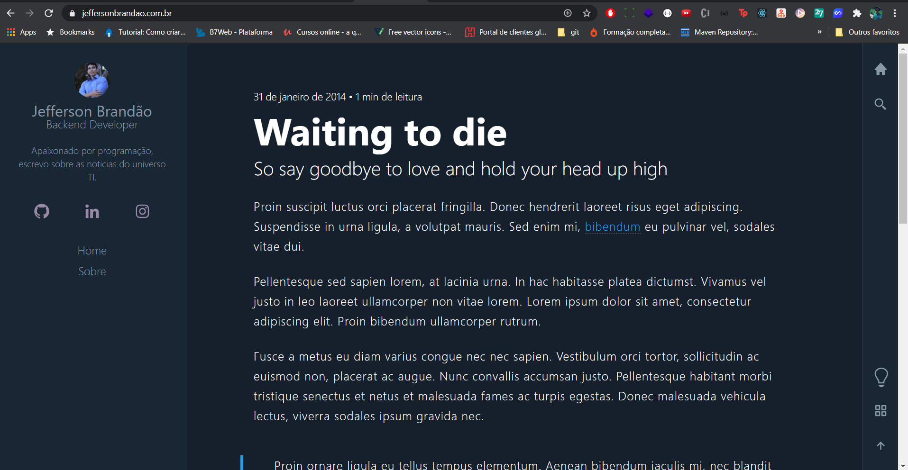

<h1 align="center">
    Jefferson Brandão - Blog
</h1>

  <a href="#-tecnologias">Tecnologias</a>&nbsp;&nbsp;&nbsp;|&nbsp;&nbsp;&nbsp;
  <a href="#-projeto">Projeto</a>&nbsp;&nbsp;&nbsp;|&nbsp;&nbsp;&nbsp;
  <a href="#memo-licença">Licença</a>

 

  

 

  

  

## 🚀 Tecnologias

Esse projeto foi desenvolvido com as seguintes tecnologias:

- [GatsBy](https://www.gatsbyjs.com/)
- [React](https://reactjs.org)
- [Netlify CMS](https://www.netlifycms.org/)
- [GraphQL](https://graphql.org/)
- [JavaScript](https://developer.mozilla.org/pt-BR/docs/Web/JavaScript)

## 💻 Projeto

O meu blog foi criado com o intuito de aprender sobre o Gatsby e Graphql, porém irei atualiza-lo com noticias que envolvem a tecnologia e futuramente algumas atualizações de melhorias. Não deixem de conferir. 💜

## 🧠 Ajude o projeto a crescer!

Caso encontre algum problema no projeto, crie um fork e depois uma nova branch com o nome da sua modificação. Em caso de duvidas, estou sempre a disposição :)

## :memo: Licença

Esse projeto está sob a licença MIT. Veja o arquivo [LICENSE](LICENSE.md) para mais detalhes.

---

Feito com ♥ by Jefferson Brandão :wave:
